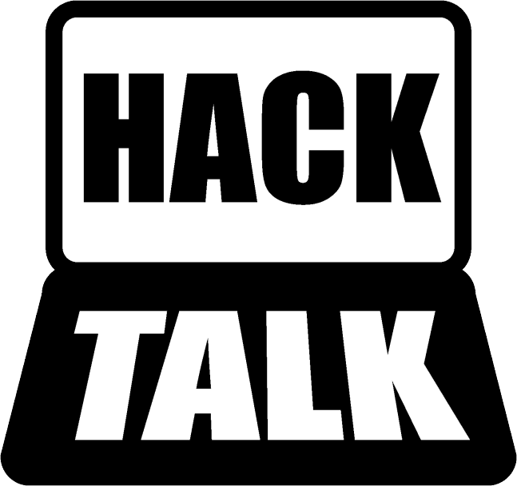
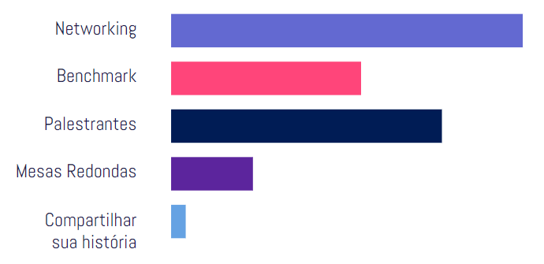
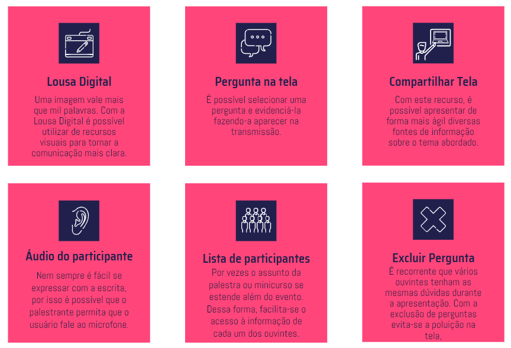
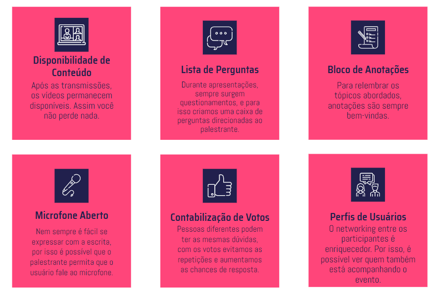
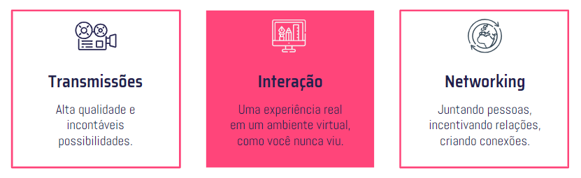
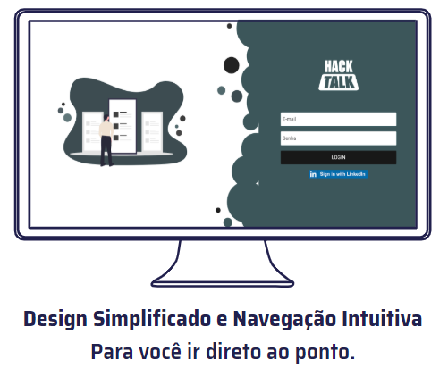
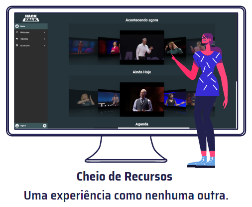

# HackTalk - Mega-Hack-2.0
Este é o repositório com a solução do Time 14, 🏆 8º lugar no desafio, para o problema proposto pela PEGN e Época Negócios.

<b>Link do Protótipo:</b> http://hacktalk.lam.software/

<h3 align="center">
   
  <b>Conectar é o nosso negócio.</b>
</h2>

  <a href="#recursos-do-palestrante">Recursos do Palestrante</a> •
  <a href="#recursos-do-participante">Recursos do Participante</a> •
  <a href="#prot%C3%B3tipo-de-telas---figma">Protótipo de Telas</a> •
  <a href="#integrantes">Integrantes</a>

## O que é o HalkTalk?
Uma plataforma moderna que combina experiências presenciais com os recursos e possibilidades de um evento virtual.

O projeto consiste no desenvolvimento de uma plataforma para realização de eventos virtuais no estilo "feira de negócios" (congressos, fóruns, seminários, entre outros). A plataforma gerencia uma ou mais transmissões ao vivo acontecendo simultaneamente, chamadas "salas", permitindo uma navegação simples e fácil dos inscritos no evento entre as transmissões que possui permissão. Como um diferencial para estes eventos virtuais, será possível rever palestras ocorridas anteriormente, solucionando assim o problema de 2 ou mais palestras de interesse que conflitam em horário. A ideia é proporcionar uma aplicação simples, com navegação intuitiva e repleto de funcionalidades com foco em melhorar os aspectos desejados nestes eventos, como: Networking, Benchmark, Conversas com Palestrantes, entre outros. Toda a plataforma funcionará online, não sendo necessário o download de qualquer ferramenta específica para participar do evento.

## Qual o foco numa feira de negócios?
Com base nos resultados obtidos na pesquisa, foram decididas as funcionalidades principais da plataforma, de modo a proporcionar a melhor experiência de um evento físico e online para todos.

<h4 align="center">
   
  Dados coletados através de formulários do Google Forms
</h3>

## Recursos do Palestrante
<h4 align="center">
   
</h4>

## Recursos do Participante
<h4 align="center">
   
</h4>

## Tudo em uma só plataforma. Pensada para ser simples e completa. 
<h4 align="center">
   
</h4>

<h4 align="center">
  
  
</h4>

### Protótipo de Telas - Figma:
https://www.figma.com/proto/g0kVN2qEQ2N0qw5aG7gMhg/Telas-do-Projeto-PEGN?node-id=185%3A780&scaling=min-zoom

### Integrantes:
- [Athus](https://github.com/athuscavalini) E-mail: athuscavalini@gmail.com
- [Leonardo](https://github.com/LKhoe) E-mail: leonardokhoury@hotmail.com
- [Matheus](https://github.com/Math-Gomes) E-mail: mathjvmf@gmail.com
- [Murilo](https://github.com/Muriloide21/) E-mail: muriloschirmer16@gmail.com
- [Vinicius](https://github.com/VLRTroll) E-mail: vinilucasreis1999@yahoo.com.br

